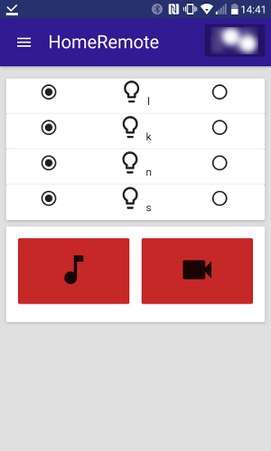

# HomeRemote

Web GUI in ES6 React for a Node backend that calls scripts spread out over several debian/ubuntu servers. The scripts 
are Upstart scripts to start/stop a radio playing service and direct shell calls to toggle a remote control for lightswitches.


## Run

After installation (see below), use ```sudo server homeremote start``` and go to https://localhost:3443

Read log file with:

* ```bunyan -o short homeremote-error.log``` (or bunyan /var/log/foo.log). Bunyan has many options for filtering.


## Screenshot




## Installation

Install Elro Home Easy


### Elro Home Easy

install 

* ```git clone https://github.com/mdvanes/he853-remote.git```
* ```sudo apt-get install libusb-1.0-0-dev```
* ```make```
* ```sudo ./he853``` e.g. ```sudo ./he853 001 1``` (0 is off, 1 is on)

there are 4 switches with id's 001, 002, 003, 004

See the repo for how to add switches. See below for information for installing Elro Home Easy on Raspberry Pi.


### Node server

Will call the Elro binary directly through Node. This requires that the node server upstart script is run as root.

On the server with the Elro USB stick plugged in, install in /opt (because of upstart script):

* cache git credentials for this session: ```git config --global credential.helper cache```
* ```cd /opt``
* check out with ```sudo git clone``` to create /opt/homeremote (update later with ```git pull origin master```)
* change ownership of the created /opt/homeremote to a normal user with ```sudo chown -R```
* ```npm i --production```
* create a settings.json in the root of the project, like:
```
#!javascript
{
    "hepath": "/home/foo/elro/he853-remote",
    "heserverip": "",
    "enableAuth": true,
    "radiologpath": "/tmp/homeremote-playradio-status.log",
    "fm": {
        "rootPath": "/path/to/list",
        "targetLocations": [
            {
                "path": "/path/to/move/to"
            }
        ]
    },
    "ftp": {
        "host": "ftp.example.com",
        "user": "ftp_user",
        "password": "ftp_pass",
        "remotePath": "/remote/directory"
    }
}
```
* it is possible to install HomeRemote on multiple servers, have the USB stick in one of them and call one from another by setting a URL in heserverip, like: http://192.168.0.25:3000
* it is possible to disable authentication (for servers that are only accessible within the LAN) by setting enableAuth to false (default is true)
* create a users.htpasswd in the root and add one user per line in the format: ```username:password```
* the /keys dir contains a server.cert and server.key. The ones in the repo are for localhost, and so only usable for debugging. Create your own (see below, Set up localhost SSL) for the target domain and place in the /keys dir.
* set up the router for access to the SSL server (do not allow non-SSL access from outside the network), enable port forwarding to <ip of this server>:3443
* ```node app.js``` or ```sudo service homeremote restart``` (see below)
 

### Upstart scripts

For the node server and toggles (e.g. radio toggle). Broadcast toggle upstart script and server need to be installed on a remote machine.
There are no upstart scripts for the (fire and forget) Elro switches.

On the server with the Elro USB stick, and speakers plugged in, install the homeremote and playradio upstart scripts:

* ```sudo cp upstart/homeremote.conf /etc/init/```
* homeremote should now be startable with ```sudo service homeremote start``` 
* ```sudo cp upstart/playradio.conf /etc/init/```
* playing the radio should now be startable with ```sudo service playradio start``` 
* the playradio upstart script is set to [3fm](http://www.3fm.nl), but the playradio.conf can be easily modified to use a different radio stream URL.


### Notes for installing on Raspberry Pi

To install the server (also for a proxy just to control the Home Easy USB stick) on a Pi with OSMC:

* If git not installed: ```sudo apt-get install git```
* Install newest version of node, but don't use apt-get 
    * installing with ```sudo apt-get install nodejs``` results in nodejs -v v0.10.29, current LTS is 4.4.3 and current stable is 5.11.0
    * instead go to https://nodejs.org/dist/ and find the latest LTS (currently 4.4.3) that ends with "armv7l" (for RPi2B, for older RPi it would be "armv6l")
    * e.g. ```wget https://nodejs.org/dist/latest-v4.x/node-v4.4.3-linux-armv7l.tar.gz```
    * untar and cd into the untarred dir
    * copy to /usr/local/ ```sudo cp -R * /usr/local/```
    * test with ```node -v```

* Follow steps under "On the server with the Elro USB stick plugged in" above.
    * npm install can take a long time on a RPi, at least 12 minutes on a RPi2
    * the settings.json should be configured to have no heserverip and enableAuth=false, if the RPi only serves as a proxy to access the Home Easy USB stick:
    ```
    {
        "hepath": "/home/foo/elro/he853-remote",
        "heserverip": "",
        "enableAuth": false,
        "radiologpath": "/tmp/homeremote-playradio-status.log"
    }
    ```
    * an (empty) users.htpasswd is needed, at least for the moment.
    * test with ```node /opt/homeremote/app.js``` before setting up the upstart scripts
    * if this is supposed to be a proxy, set up the other homeremote server, that provides the webaccess and is securely behind HTTPS and basic AUTH to point to this server in the settings.json heserverip.
      E.g. if the proxy server address is http://192.168.0.19:3000, set up the main homeremote server with: ```"heserverip":"http://192.168.0.19:3000"``` and restart the main server with ```sudo service homeremote restart```
    * At this time OSMC doesn't use Upstart, but it is possible to set up a daemon service. See below for more details. 
* Server is on http://localhost:3000/

Source: https://blog.wia.io/installing-node-js-v4-0-0-on-a-raspberry-pi

#### Set up systemd service

* ```cd /etc/systemd/system```
* Create a file ```sudo pico homeremote.service``` with content:
        
```
#!bash

[Unit]
Description=HomeRemote

[Service]
User=root
WorkingDirectory=/opt/homeremote/
ExecStart=/usr/local/bin/node app.js
Restart=always
# Restart service after 10 seconds if node service crashes
RestartSec=10
# Output to syslog
StandardOutput=syslog
StandardError=syslog
SyslogIdentifier=homeremote

[Install]
WantedBy=multi-user.target
```

* ```sudo systemctl daemon-reload```
* ```sudo systemctl start homeremote.service``` (should keep running after CTRL-C, or try ```sudo systemctl start homeremote.service &```)
* This last instruction should be called automatically when booting.
* Stop with: ```sudo systemctl stop homeremote.service```
* Status with: ```sudo systemctl status homeremote.service```


#### Temporarily disable git security on raspberry pi:

* ```git config --global http.sslVerify false``` 
* and afterwards enable with ```git config --global http.sslVerify true```

#### Installing Home Easy on Raspberry Pi with OSMC:

* If git not installed: ```sudo apt-get install git```
* ```git clone https://github.com/mdvanes/he853-remote.git```
* (for usb.h and gcc) ```sudo apt-get install libusb-1.0-0-dev libusb-dev build-essential```
* mv he853-remote/libhid-0.2.16.tar.gz .
* tar xvzf libhid-0.2.16.tar.gz
* cd libhid-0.2.16
* ./configure
* make
* got error, followed steps from (based on http://matthewcmcmillan.blogspot.nl/2013/03/compiling-libhid-for-raspbian-linux-on.html)
* in /libhid-0.2.16/test/lshid.c

```
#!c
    Here is the code before making the edit:

    39 /* only here to prevent the unused warning */
    40 /* TODO remove */
    41 len = *((unsigned long*)custom);
    42
    43 /* Obtain the device's full path */
    
    Here is the code after the edit.
    You need to comment out line 41 and then add len = len; and custom = custom;
    
    39 /* only here to prevent the unused warning */
    40 /* TODO remove */
    41 //len = *((unsigned long*)custom);
    42 len = len;
    43 custom = custom;
    44
    45 /* Obtain the device's full path */
```

* make
* sudo make install
* cd ../he853-remote
* pico he853-remote/hid-libusb.c
* change ```include <libusb.h>``` to ```<libusb-1.0/libusb.h>```
* make
* plug in
* test with ```sudo ./he853 002 1```

## Set up localhost SSL

On Ubuntu, in a temp dir do:

* ```openssl req -x509 -newkey rsa:2048 -keyout key.pem -out cert.pem -days XXX -nodes -subj '/CN=localhost'```
* This will create a cert.pem (certificate) and a key.pem (prive key).
* Rename and move key.pem from the Ubuntu system to keys/localhost.key in this dir.
* Likewise, rename and move cert.pem to keys/localhost.cert

details:

* -nodes => no DES, so do not use a password
* -subj => configure 
* also possible with -subj '/CN=servername.local' for testing on a server within a network

Note:

1. AppCache will fail when using a self-signed certificate. Starting Chrome with ```--ignore-certicate-errors``` should help, and also using a real certificate should work.
Otherwise, for testing AppCache, just use the non-SSL entrypoint at :3000
2. The SSL certificate that I created for use within the network (e.g. "foo.local") also seems to works for the external domain (e.g. "foo.com"), albeit with warnings. This is good enough for now.  


## TODO

* DONE js sourcemap doesn't work
* Replace double installation (part on RPi) with API calls to Domoticz on port 8080
* FTP and file manager for often used tasks
* Youtube script
* Remove all HTTPS, only use behind Reverse Proxy with HTTPS
* OUTDATED Disable HTTP, only allow HTTPS
* OUTDATED Although HTTPS works with a self-signed certificate, try HTTPS with letsencrypt (https://github.com/Daplie/node-letsencrypt or http://blog.bguiz.com/2015/12/16/letsencrypt-tls-certs-nodejs/)
* add timer to turn a switch on or off. Maybe with: https://www.npmjs.com/package/node-schedule
* add http basic authentication (or better digest access?)
* strip packages from package.json until no longer works, because there are some unused packages in there
* extract everything that is on a remote server (only broadcast for now) to a subdir: remote-broadcast-server with it's own node server and upstart scripts
* Add static typing with Flow: doesn't work on Windows but works on Ubuntu and probably on Travis. The problem is that this requires transpilation to remove the typing, so it would not be possible to build on Windows anymore.
* React Native output
* bunyan logging in grunt-express
* bunyan logging on RPi (requires npm on RPi)
* should have rotating logs (bunyan offers support for it)
* combine modules in Babel or sourcemaps on Babel->Uglify
* Use webpack-dev server with middleware