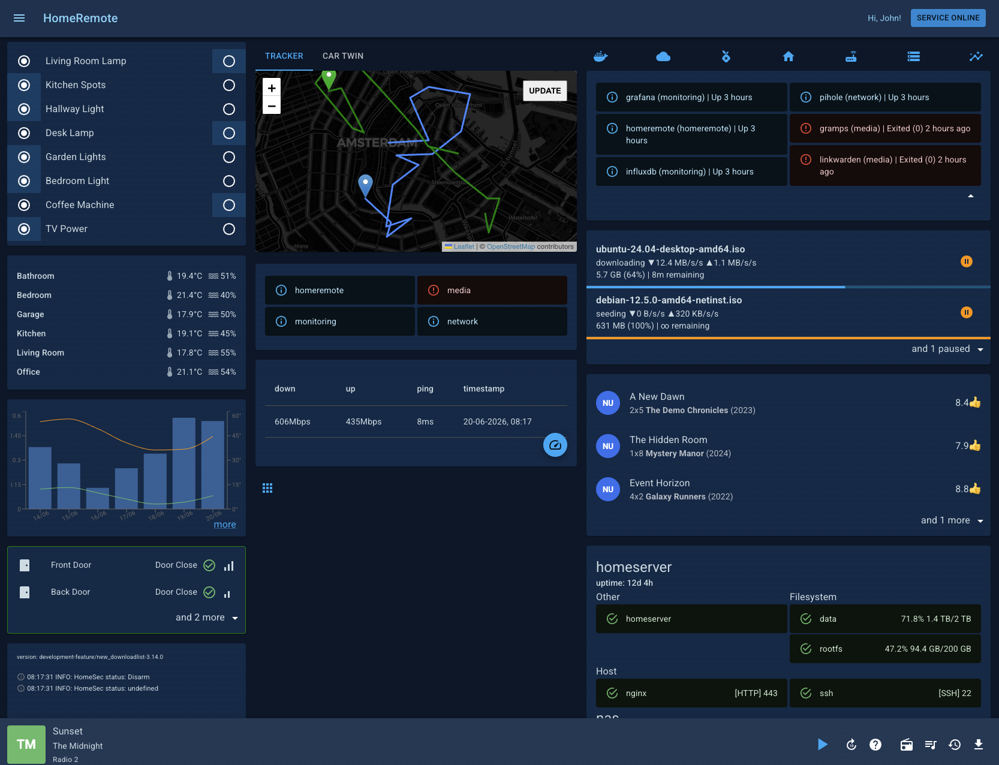

# HomeRemote

React/NestJS home automation dashboard. A Node backend aggregates data from
various home-automation services and exposes a unified REST API; the React
frontend presents everything in a single Material UI interface.

## Screenshot



## Requirements

- Caddy reverse proxy with SSL
- Node backend (server) and React frontend (client), run via Docker Compose

Optional systems that can be connected (configured in `apps/server/.env`):

- [Home Assistant](https://www.home-assistant.io/) (temperature, gas, water sensors, switches, device trackers)
- [Subsonic](http://www.subsonic.org/)-compatible server (jukebox / music streaming)
- [Portainer](https://www.portainer.io/) (Docker container management)
- [Monit](https://mmonit.com/monit/) (service monitoring)
- [Authentik](https://goauthentik.io/) or another OpenID Connect provider (SSO login)
- HomeSec (home security alarm)
- Download client
- Volvo car integration (Cartwin)
- [InfluxDB](https://www.influxdata.com/) (deprecated)
- [DataLora](https://github.com/mdvanes/datalora) (deprecated)

## Installation

1. create a config dir: `mkdir -p ~/homeremote/settings`
2. set up environment variables: `cp apps/server/.env.example ~/homeremote/settings/.env` and update with your values
3. set up auth file: `cp apps/server/auth.json.example ~/homeremote/settings/auth.json` and add at least one user (see [User Management](#user-management))
4. copy `docker-compose.yml` to `~/homeremote/` and update the `volumes` "auth" and "songsfrom" paths
5. start with `docker compose up -d`

The app will be available at the host configured in your Caddy reverse proxy.
To follow the logs: `docker compose logs --follow`

### Updating

To update to a new release, change the image tag in `docker-compose.yml` and re-run:

```sh
docker compose pull && docker compose up -d
```

## User Management

### Adding a user

- This endpoint is only enabled in development mode
- Start dev server: `npm start`
- For password "test", call (e.g. in browser) `http://localhost:4200/api/pw-to-hash/?password=test`
- Store the hash with the username in auth.json

### SSO / OIDC login with Authentik

Next to the local username/password login, HomeRemote can optionally let users
sign in through an OpenID Connect provider such as
[Authentik](https://goauthentik.io/). When configured, a "Log in with Authentik"
button is shown on the login page.

SSO is **optional**: when no `oidc` block is present in `auth.json`, the OIDC
routes and the login button are not enabled, and nothing changes.

#### How it works

- The server uses `openid-client` (Passport strategy) and discovers the
  provider from its issuer URL.
- On a successful login, the same long-lived http-only `Authentication` JWT
  cookie is issued as for local login, so the rest of the app is unchanged.
- **Allowlist:** SSO authentication only succeeds for users that already exist
  in `auth.json`. The configured `usernameClaim` (default `preferred_username`)
  from the OIDC token must match a user's `name`. If there is no match, login is
  rejected even when the provider authenticated the user.

#### 1. Configure the provider (Authentik)

- Create an OAuth2/OpenID **Provider** and an **Application** for HomeRemote.
- Set the redirect URI to `https://<your-host>/auth/oidc/callback`.
- Use scopes `openid profile email`.
- Note the **Client ID**, **Client Secret**, and the **issuer/OpenID
  configuration** URL (e.g. `https://authentik.example.com/application/o/homeremote/`).

#### 2. Configure HomeRemote (`auth.json`)

Add an `oidc` block (see `apps/server/auth.json.example`):

```jsonc
"oidc": {
  "issuer": "https://authentik.example.com/application/o/homeremote/",
  "clientId": "my_client_id",
  "clientSecret": "my_client_secret",
  "callbackUrl": "https://homeremote.example.com/auth/oidc/callback",
  "scope": "openid profile email",        // optional, this is the default
  "usernameClaim": "preferred_username"   // optional, this is the default
}
```

#### 3. Configure users for SSO

Because of the allowlist, every user that signs in via Authentik must have a
matching entry in the `users` array of `auth.json`.

- **Existing local user → also allow SSO:** ensure the user's Authentik
  `preferred_username` (or whatever `usernameClaim` you configured) equals their
  `auth.json` `name`. No other change is needed — they can log in with either
  their local password or the Authentik button.
- **New SSO-only user (no local password):** add a `users` entry whose `name`
  matches the Authentik username, together with a unique `id` and a
  `displayName`. Set `hash` to a value that can never match a bcrypt comparison
  (e.g. `"!"`) so the account has no usable local password. The user then logs in
  only via Authentik.

```jsonc
{
    "id": 2,
    "name": "sso-only-user", // must equal the Authentik username claim
    "displayName": "SSO Only User",
    "hash": "!", // no usable local password
}
```

- **Deny access:** omit a user from `auth.json` (or remove their entry) to deny
  them access, even if Authentik successfully authenticates them.

## Demo mode

HomeRemote can run as a self-contained **demo** where every backend call is answered with fake data.

How it works:

- All demo code lives in `apps/client/src/demo/` and is only loaded when the
  demo flag is set.
- A [Mock Service Worker](https://mswjs.io/) registered in the browser
  intercepts the HTTP calls and returns generated data (schemas/types drive the
  shapes; chart/time-series endpoints use small trending generators).
- The auth flow is stubbed so the app auto-"signs in" as a "Demo User".

Enable it with any of:

- build env `NX_PUBLIC_DEMO=true` (for a static demo deployment), or
- visiting the app with `?demo` (e.g. `http://localhost:4202/?demo`) — the flag
  is persisted for the session; clear it again with `?demo=false`, or
- `localStorage.demo = "true"`.

Convenience scripts:

- `npm run demo:serve` — run the dev server with demo mode always on.
- `npm run demo:build` — produce a static demo build (`dist/apps/client`).

## Development

### Development server

- serve all: `npm start` or `npx nx run-many --target=serve --projects=server,client --parallel`

### Utility scripts

- serve client: `npx nx serve:all` or `npx nx serve client` or `npx nx run client:serve`
- Add an app (without e2e): `npx nx g @nx/react:application --name=client --e2eTestRunner=none --dry-run` or `npx nx g @nx/nest:application --name=server --frontendProject=client --dry-run`
- Remove an app: `npx nx g rm homeremote-server-e2e --dry-run`
- Move/rename an app: `npx nx g mv --project homeremote client --dry-run`
- To build storybook run: `npx nx run demo:build-storybook`
- Run lint on all projects: `npx nx run-many --all --target=lint` (with `npx nx lint` only the default project is linted) or for a specific project `npx nx run server:lint`
- Testing:
    - with watch: `npm run test:client` or `npx nx test client --watch`
    - a single file without coverage and with watch, e.g. users.service: `npm run test:server -- --testFile=users.service`
- Add a controller: `npx nx g @nx/nest:controller --name=foo --project=server --module=app --dry-run`
- Format (prettier):
    - check changed: `npx nx format:check`
    - format changed: `npx nx format:write`
    - format all: `npx nx format:write --all`

Api proxying: server is running on 3333 and client on 4200, but a proxy.conf.json exists that forwards /api from 4200 to 3333.

- `npm start`
- This URL works: http://localhost:4200/api/profile/current

env files: https://nx.dev/guides/environment-variables

### Building / Run in production

- Install on Mac: python is on path, but can't be found by npm, even with `npm config python`. This makes the youtube-dl dependency installation fail when running `npm i` or `npm i -f` or even `npm i --python=python3`. For now, just remove `youtube-dl` on Mac from package.json, `npm i`, `npm i youtube-dl@^3.5.0 --ignore-scripts`
- Python also failing Mac M1 and Ubuntu now. `which python` gives nothing, `which python3` gives `/usr/bin/python3`. Symlink: `ln -s /usr/bin/python3 /usr/bin/python`
- Optional: test building with `npm run build`
- Make sure apps/server/.env and apps/server/auth.json exist
- Set correct path for volumes in docker-compose.yml
- When on Mac with Lima: disable docker.sock volume in docker-compose.yml (or try https://github.com/abiosoft/colima)
- `docker-compose up -d --build`. Build duration: ca. 4 minutes
- On Mac with colima use
    - `colima start --network-address`
    - `DOCKER_DEFAULT_PLATFORM=linux/amd64 docker compose -f docker-compose.override.yml up --build`. Real docker-compose automatically finds docker-compose.yml and docker-compose.override.yml.
    - If docker.sock does not work, maybe this will help https://github.com/abiosoft/colima/blob/main/docs/FAQ.md#cannot-connect-to-the-docker-daemon-at-unixvarrundockersock-is-the-docker-daemon-running
        - `export DOCKER_HOST="unix://${HOME}/.colima/default/docker.sock"`
        - `sudo ln -sf $HOME/.colima/default/docker.sock /var/run/docker.sock`
        - in docker-compose.override.yml, just map `- /var/run/docker.sock:/var/run/docker.sock`
- Show logs: `docker-compose logs --follow`
- Alternative, instead of docker compose (e.g. for debugging):
    - `DOCKER_BUILDKIT=0 docker build -t homeremotenx .` and
    - `docker run --rm --name homeremotenx homeremotenx ls -lah dist/apps/server/src/assets/`
- If yarn install fails with timeouts on Mac with Lima compose (`lima nerdctl compose up`):
    - Seems to be Lima issue: https://github.com/lima-vm/lima/issues/561
    - https://github.com/yarnpkg/yarn/issues/5259
    - Solved by setting `RUN yarn install --frozen-lockfile --network-timeout 1000000` in Dockerfile

### Publishing

Publishing is fully automated via GitHub Actions. Make sure the following secrets and permissions are configured in the repository settings:

- `secrets.DOCKER_USERNAME` and `secrets.DOCKER_PASSWORD` (Docker Hub)
- Actions → General → Workflow permissions set to **Read and write** (required for GHCR and GitHub Releases)

#### Automated publishing

1. Merge changes to the main branch — the release workflow triggers automatically
2. The workflow will:
    - Determine the version bump type from commit messages since the last tag using [conventional commits](https://www.conventionalcommits.org/): `BREAKING CHANGE` or `type!:` → major, `feat:` → minor, anything else → patch
    - Bump the version in `package.json` and commit it
    - Create and push an annotated tag `vX.Y.Z`
    - Trigger the publish workflow, which builds and pushes the Docker image to [Docker Hub](https://hub.docker.com/r/mdworld/homeremote) and [GHCR](https://ghcr.io/mdvanes/homeremote)
    - Create a GitHub Release titled `Release vX.Y.Z` with the commit messages since the previous tag as release notes
3. On the target server, update the version in `docker-compose.yml` and run `docker-compose up -d`

#### Manual publishing

Fallback, e.g. if CI is unavailable.

- Build image: `docker build -t mdworld/homeremote:X.Y.Z .` (on Mac: `docker build --build-arg INSTALL_TIMEOUT="--network-timeout 1000000" -t mdworld/homeremote:X.Y.Z .`)
- Push to registry (note: also works with nerdctl on Mac, see https://github.com/containerd/nerdctl/blob/master/docs/registry.md#docker-hub):
    - `docker login --username=yourhubusername`
    - `docker push mdworld/homeremote:X.Y.Z`
    - `docker logout`

### Generate types

- Intercept a JSON to the intended endpoint, e.g. with cURL
- Save the JSON in `./libs/types/examples`. The `internal` subdir is for endpoints in this repo, the `external` subdir is for endpoints outside this repo, e.g. from third parties if they don't provide their own OpenApi descriptions.
- Run `npx mock-to-openapi ./libs/types/examples`
- Copy the generated snippet from `./libs/types/examples` to the appropriate schema in `./libs/types/definitions`
- If there is no schema yet, this can be helpful to build one: https://editor.swagger.io/
- Run `npm run codegen`
- Types should be generated for the server and hooks for the client.

### Notes

- "noPropertyAccessFromIndexSignature": was turned to false when migrating, also see https://www.typescriptlang.org/tsconfig#noPropertyAccessFromIndexSignature

- For Apple Silicon / ARM / Mac M1 there is an issue that the build will because it uses a platform specific version of @swc/core. Adding the ARM specific version @swc/core-darwin-arm64 breaks CI. Workaround to test the build locally is: `docker build . -t mdworld/homeremote:latest --platform=linux/amd64`

- For Apple Silicon / ARM / Mac M1 with Colima, when Docker build fails with 'killed', try increasing available memory to 8GB with `colima stop && colima start --cpu 2 --memory 8`
