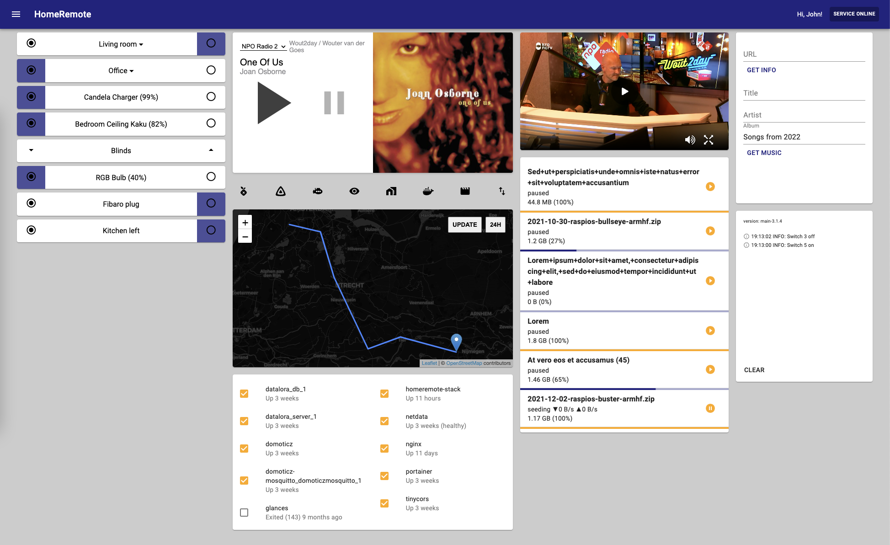

# HomeRemote

Web GUI in ES6 React for a Node backend that calls scripts spread out over several debian/ubuntu servers. The scripts 
are Upstart scripts to start/stop a radio playing service and direct shell calls to toggle a remote control for lightswitches.


## Run

After installation (see below), use ```sudo server homeremote start``` and go to https://localhost:3443

Read log file with:

* ```bunyan -o short homeremote-error.log``` (or bunyan /var/log/foo.log). Bunyan has many options for filtering.


## Screenshot




## Installation

Install Elro Home Easy


### Elro Home Easy

install 

* ```git clone https://github.com/mdvanes/he853-remote.git```
* ```sudo apt-get install libusb-1.0-0-dev```
* ```make```
* ```sudo ./he853``` e.g. ```sudo ./he853 001 1``` (0 is off, 1 is on)

there are 4 switches with id's 001, 002, 003, 004

See the repo for how to add switches.


### Node server

Will call the Elro binary directly through Node. This requires that the node server upstart script is run as root.

On the server with the Elro USB stick plugged in, install in /opt (because of upstart script):

* cache git credentials for this session: ```git config --global credential.helper cache```
* ```cd /opt``
* check out with ```sudo git clone``` to create /opt/homeremote (update later with ```git pull origin master```)
* change ownership of the created /opt/homeremote to a normal user with ```sudo chown -R```
* ```npm i --production```
* create a settings.json in the root, like:
```
{
    "hepath": "/home/foo/elro/he853-remote",
    "heserverip": "",
    "enableAuth": true,
    "radiologpath": "/tmp/homeremote-playradio-status.log"
}
```
* it is possible to install HomeRemote on multiple servers, have the USB stick in one of them and call one from another by setting a URL in heserverip, like: http://192.168.0.25:3000
* it is possible to disable authentication (for servers that are only accessible within the LAN) by setting enableAuth to false (default is true)
* create a users.htpasswd in the root and add one user per line in the format: ```username:password```
* the /keys dir contains a server.cert and server.key. The ones in the repo are for localhost, and so only usable for debugging. Create your own (see below, Set up localhost SSL) for the target domain and place in the /keys dir.
* set up the router for access to the SSL server (do not allow non-SSL access from outside the network), enable port forwarding to <ip of this server>:3443
* ```node app.js``` or ```sudo service homeremote restart``` (see below)
 

### Upstart scripts

For the node server and toggles (e.g. radio toggle). Broadcast toggle upstart script and server need to be installed on a remote machine.
There are no upstart scripts for the (fire and forget) Elro switches.

On the server with the Elro USB stick, and speakers plugged in, install the homeremote and playradio upstart scripts:

* ```sudo cp upstart/homeremote.conf /etc/init/```
* homeremote should now be startable with ```sudo service homeremote start``` 
* ```sudo cp upstart/playradio.conf /etc/init/```
* playing the radio should now be startable with ```sudo service playradio start``` 
* the playradio upstart script is set to [3fm](http://www.3fm.nl), but the playradio.conf can be easily modified to use a different radio stream URL.


### Notes for installing on Raspberry Pi

To run:

* Temporarily disable git security on raspberry pi (see below)
* Clone the repo
* Install newest version of node, but don't use apt-get: http://node-arm.herokuapp.com/
* Copy node_modules over sftp
* ```node app.js```
* Server is on http://localhost:3000/

Temporarily disable git security on raspberry pi:

* ```git config --global http.sslVerify false``` 
* and afterwards enable with ```git config --global http.sslVerify true```


## Set up localhost SSL

On Ubuntu, in a temp dir do:

* ```openssl req -x509 -newkey rsa:2048 -keyout key.pem -out cert.pem -days XXX -nodes -subj '/CN=localhost'```
* This will create a cert.pem (certificate) and a key.pem (prive key).
* Rename and move key.pem from the Ubuntu system to keys/localhost.key in this dir.
* Likewise, rename and move cert.pem to keys/localhost.cert

details:

* -nodes => no DES, so do not use a password
* -subj => configure 
* also possible with -subj '/CN=servername.local' for testing on a server within a network

Note:

1. AppCache will fail when using a self-signed certificate. Starting Chrome with ```--ignore-certicate-errors``` should help, and also using a real certificate should work.
Otherwise, for testing AppCache, just use the non-SSL entrypoint at :3000
2. The SSL certificate that I created for use within the network (e.g. "foo.local") also seems to works for the external domain (e.g. "foo.com"), albeit with warnings. This is good enough for now.  


## TODO

* add timer to turn a switch on or off. Maybe with: https://www.npmjs.com/package/node-schedule
* js sourcemap doesn't work
* add http basic authentication (or better digest access?)
* strip packages from package.json until no longer works, because there are some unused packages in there
* Disable HTTP, only allow HTTPS
* Although HTTPS works with a self-signed certificate, try HTTPS with letsencrypt (https://github.com/Daplie/node-letsencrypt or http://blog.bguiz.com/2015/12/16/letsencrypt-tls-certs-nodejs/)
* extract everything that is on a remote server (only broadcast for now) to a subdir: remote-broadcast-server with it's own node server and upstart scripts
* Add static typing with Flow: doesn't work on Windows but works on Ubuntu and probably on Travis. The problem is that this requires transpilation to remove the typing, so it would not be possible to build on Windows anymore.
* React Native output
* bunyan logging in grunt-express
* bunyan logging on RPi (requires npm on RPi)
* should have rotating logs (bunyan offers support for it)
* combine modules in Babel or sourcemaps on Babel->Uglify
